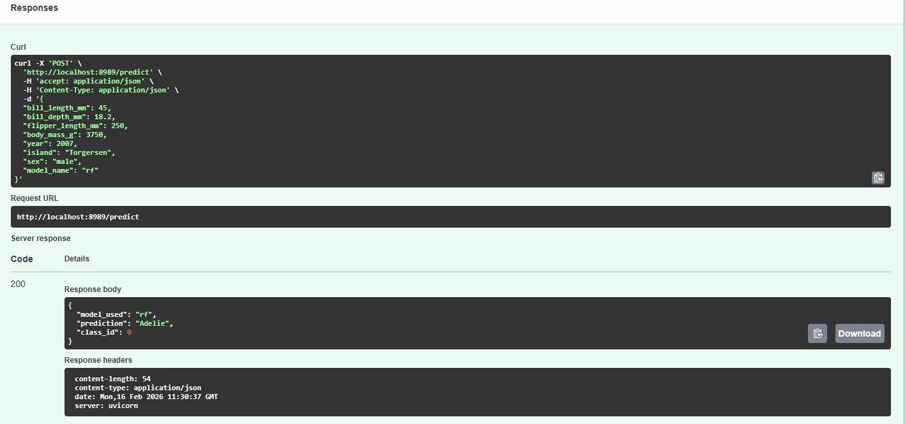
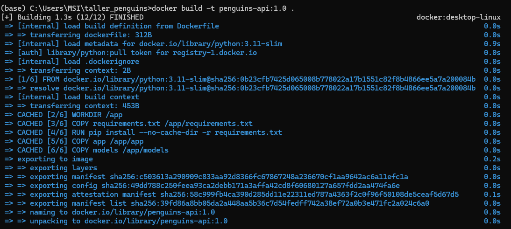
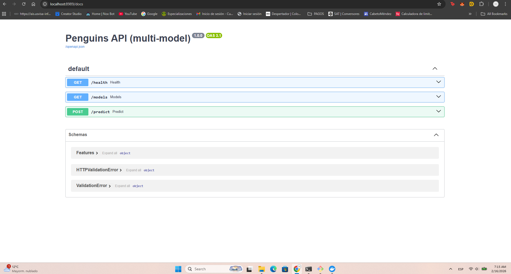
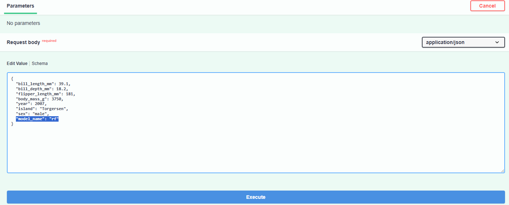
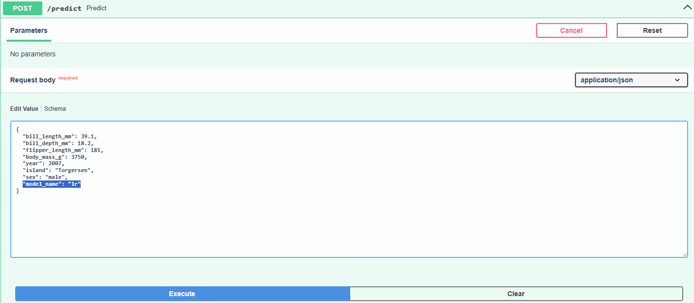
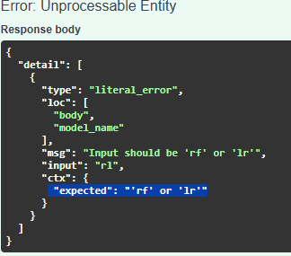

# mlops
MLOPS
Documentacion

Se genero la ruta del proyecto 
C:\Users\MSI\taller_penguins

1. Generanmos el train.py,
  
  Este script realiza:
Limpieza de datos (imputación de medianas en variables numéricas)
Imputación de moda en `sex`
Codificación de variables categóricas (`island`, `sex`)
Codificación de la variable objetivo species con LabelEncoder
Feature engineering:
  - `bill_ratio`
  - `mass_per_flipper_length`
Balanceo de clases con **SMOTE**
Entrenamiento de modelos:
  - RandomForestClassifier
  - LogisticRegression
    
Como resultado esta generando 3 archivos
   "rf_model.joblib" -- Entrenamiento de randomforest
   "lr_model.joblib" -- Entrenamiento de Logistic Regression
   "label_encoder.joblib" -- El resultado de estos modelos da en 0-1-2, y aqui lo cambia por el nombre de la especie del pinguino

2. Luego generamos el main.py

Aqui se construyo la API como tal

Seleccionar el modelo a utilizar (`rf` o `lr`)
Recibir variables del pingüino
Generar predicción de especie

Body de ejemplo
{
  "bill_length_mm": 39.1,
  "bill_depth_mm": 18.2,
  "flipper_length_mm": 181,
  "body_mass_g": 3750,
  "year": 2007,
  "island": "Torgersen",
  "sex": "male",
  "model_name": "rf"
}

Response
{
  "model_used": "rf",
  "prediction": "Adelie",
  "class_id": 0
}

### Resultado

Ahora generar el docker

(OPCIONAL) 
python train.py, este no es necesario volverlo a ejecutar debido a que ya estan creados los modelos

1. Creamos el docker
   docker build -t penguins-api:1.0 .
   ### Docker
  
2. Ahora ejecutamos el docker creado con el siguiente comando
   docker run -p 8989:8989 penguins-api:1.0

Y ahora si podemos ingresar a nuestra api en la direccion local

  ### Api

Bono 

En la ejecucion de la API se pueden elegir dos modelos cargados 

Random forest o Regresion logistica

en este parametro, se correra en el modelo de random forest

  ### Modelorf

en este parametro, se correra en el modelo de Regresion Logistica

  ### Modelolr

Si algun parametro queda mal escrito igual el te va a decir lo que espera

  ### error

   

   
